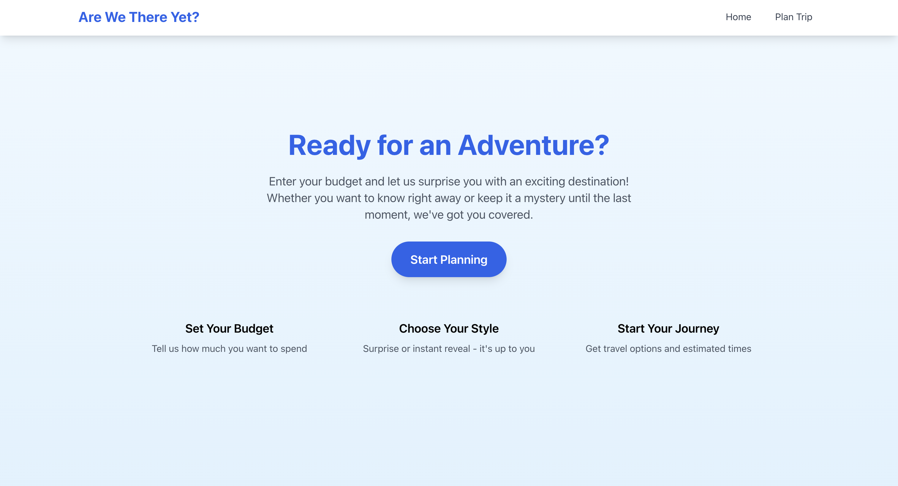
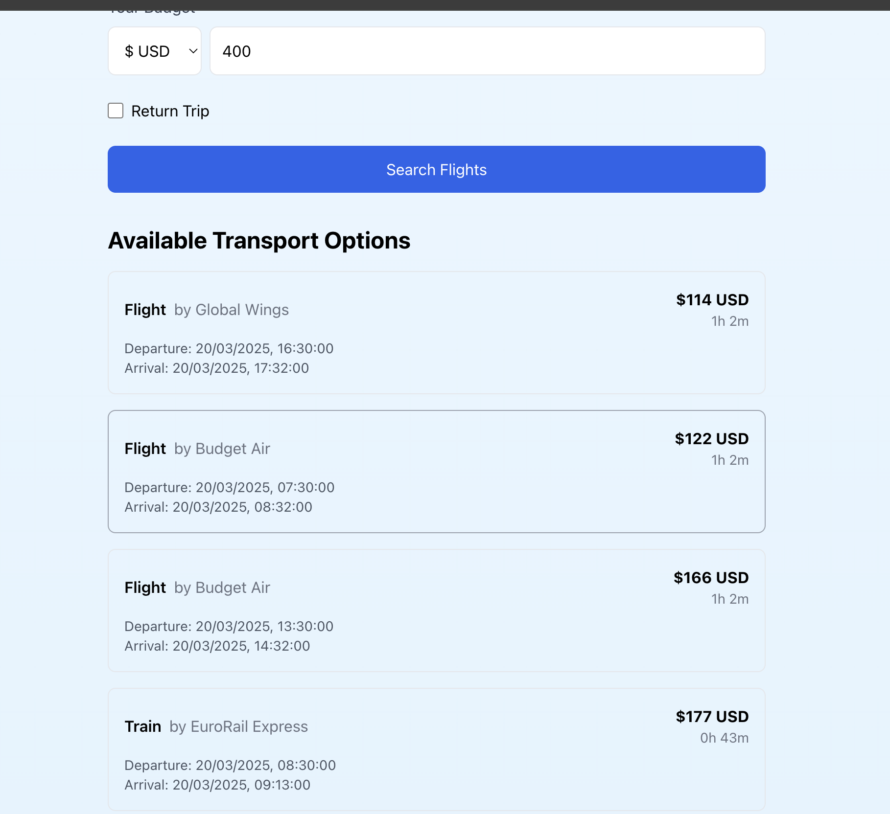
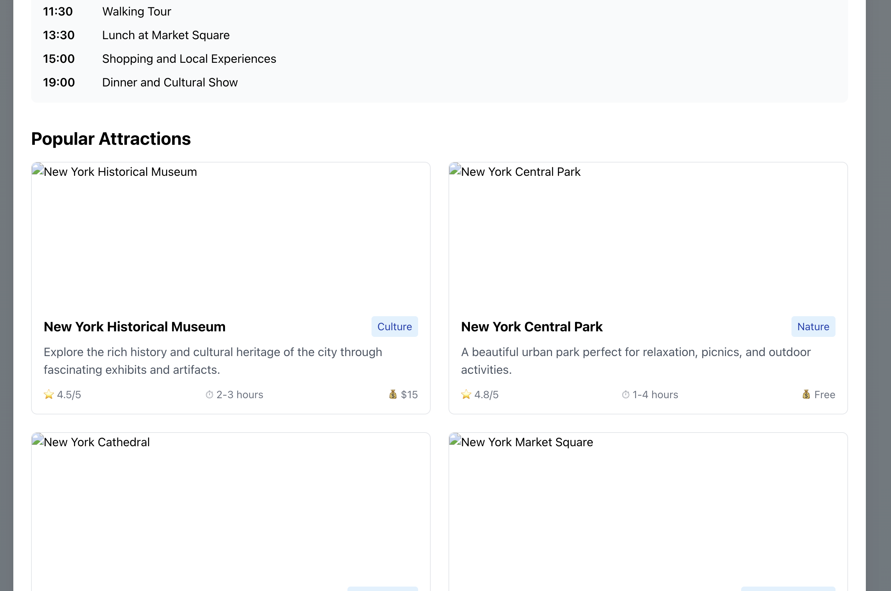
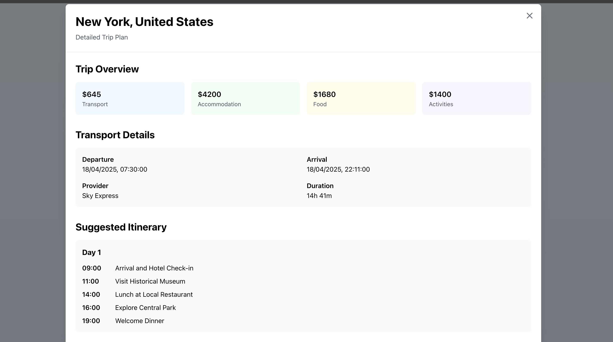
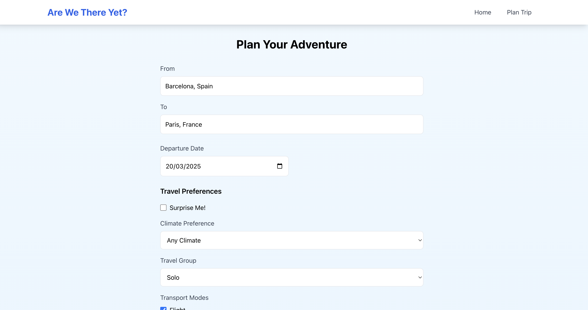

# 🌍 Are We There Yet? - Your AI-Powered Travel Companion

[](https://piyushhhhh.github.io/are-we-there-yet)
[](https://github.com/Piyushhhhh/are-we-there-yet/stargazers)

> 🚀 **Try it now**: [Are We There Yet?](https://piyushhhhh.github.io/are-we-there-yet)

Transform your travel planning experience with our AI-powered travel companion! Say goodbye to endless spreadsheets and scattered bookmarks. Are We There Yet? brings you intelligent destination matching, smart budgeting, and personalized recommendations - all in one beautiful interface.

## ✨ Why Choose Are We There Yet?

- 🤖 **AI-Powered Recommendations** - Let our smart algorithms find your perfect destination
- 💰 **Smart Budget Planning** - Get realistic cost estimates and budget breakdowns
- 🎯 **Personalized Matching** - Find destinations that match your interests and budget
- 🏛️ **Rich Attraction Database** - Explore curated lists of must-visit places
- 📊 **Real-time Currency Exchange** - Stay updated with latest rates
- 🎨 **Beautiful UI/UX** - Enjoy a seamless and intuitive interface

## 🖼️ Experience the Magic

<div align="center">
  
</div>

### 🎯 Smart Travel Planning
<div align="center">
  
</div>

### 🏛️ Discover Amazing Places
<div align="center">
  
</div>

### 📝 Detailed Trip Information
<div align="center">
  
</div>

## 🚀 Key Features

### 🎯 AI-Powered Planning
- Smart destination matching based on your preferences
- Intelligent budget recommendations
- Personalized attraction suggestions
- Duration and itinerary optimization

### 💰 Budget Management
- Real-time currency conversion
- Detailed cost breakdowns
- Budget-based destination suggestions
- Cost-of-living comparisons

### 🏛️ Attractions & Activities
- Category-based organization
- High-quality destination images
- Opening hours and best visit times
- Entrance fees and visitor ratings
- Estimated visit durations

### 🎨 User Experience
- Intuitive interface
- Responsive design
- Real-time search suggestions
- Interactive maps and visualizations

## 🌟 Get Started

1. Visit our live app: [Are We There Yet?](https://piyushhhhh.github.io/are-we-there-yet)
2. Enter your desired destinations
3. Set your budget
4. Let our AI guide you to your perfect trip!

## 💡 Contributing

We love contributions! If you have ideas for improvements or find any bugs, please:
1. Fork the repository
2. Create your feature branch
3. Submit a pull request

## 📝 License

This project is licensed under the MIT License - see the LICENSE file for details.

---

<div align="center">

### 🌍 Start Planning Your Dream Trip Now!

[](https://piyushhhhh.github.io/are-we-there-yet)

</div>

## ✨ Features

### 🎯 Smart AI-Powered Recommendations
- Intelligent destination matching based on your budget
- Smart cost analysis and breakdown
- Personalized travel duration suggestions
- Match scoring system considering:
  - Budget optimization (50%)
  - Duration suitability (30%)
  - Preference matching (20%)

### 💰 Budget Planning & Analysis
- Multi-currency support with real-time conversion
- Smart budget breakdowns for:
  - Transportation
  - Accommodation
  - Food & Dining
  - Activities & Entertainment
- Visual budget distribution charts
- Cost of living adjustments by city
- Real-time currency exchange rates

### 🗺️ Comprehensive Trip Planning
- Detailed itineraries with day-by-day activities
- Popular attractions with:
  - High-quality images and descriptions
  - Category-based organization
  - Ratings and reviews
  - Estimated visit durations
  - Entrance fees
  - Best times to visit
- Local transportation options
- Weather forecasts

### 🎲 Destination Discovery
- City categorization (Budget, Moderate, Luxury)
- Rich city information including:
  - Popular attractions
  - Local culture
  - Best times to visit
  - Cost estimates
- Category-based image galleries
- Smart fallback images by category

## 🖥️ Screenshots & Features

### Home Screen & Destination Search
<div align="center">
  
</div>

- Clean, modern interface
- Quick search functionality with autocomplete
- Popular destinations showcase
- From and To destination fields
- Real-time suggestions as you type

### Budget Planning Interface
<div align="center">
  
</div>

- Interactive budget input
- Multi-currency support
- Smart budget distribution
- Real-time currency conversion
- Visual cost breakdown

### Trip Details & Attractions
<div align="center">
  
</div>

- Comprehensive trip overview
- Transport and accommodation details
- Cost breakdown visualization
- Day-by-day itinerary planning

### Popular Attractions View
<div align="center">
  
</div>

#### Key Features:
- **Category-based Cards**: Organized view of city attractions by type
- **Rich Media**: High-quality destination images with smart fallbacks
- **Detailed Information**:
  - ⏰ Opening hours and best visit times
  - 💰 Entrance fees and pricing
  - ⭐ Visitor ratings and reviews
  - ⌛ Estimated visit duration
- **Visual Elements**:
  - Color-coded category tags
  - Interactive hover effects
  - Responsive card layout
  - Accessibility-friendly design

## 🎯 AI Features in Detail

### 1. Smart Destination Matching
- Budget-based filtering
- Cost of living adjustments
- Match score calculation
- Preference consideration

### 2. Cost Analysis
- City tier categorization (Budget/Moderate/Luxury)
- Daily cost calculations
- Budget optimization
- Flexible duration suggestions

### 3. Attraction Recommendations
- Category-based suggestions
- Dynamic image loading with smart fallbacks
- Rating and pricing information
- Intelligent categorization:
  - Culture & Museums
  - Nature & Parks
  - Architecture & Landmarks
  - Shopping & Markets

### 4. Itinerary Generation
- Time-optimized schedules
- Activity categorization
- Duration management
- Meal time considerations

## 🛠️ Tech Stack

- **Frontend:**
  - React 18
  - TypeScript
  - Tailwind CSS
  - Lodash

- **APIs & Services:**
  - 🌐 GeoDB Cities API for destination data
  - 💱 Exchange Rate API for currency conversion
  - 🖼️ Dynamic image loading with fallback system
  - 🗺️ Maps integration for location visualization

## 🚀 Getting Started

### Prerequisites
- Node.js (v14 or higher)
- npm or yarn
- API keys for external services

### Installation

1. Clone the repository:
```bash
git clone https://github.com/Piyushhhhh/are-we-there-yet.git
cd are-we-there-yet
```

2. Install dependencies:
```bash
cd client
npm install
```

3. Set up environment variables:
Create a `.env` file in the client directory:
```env
REACT_APP_RAPIDAPI_KEY=your_api_key_here
```

4. Start the development server:
```bash
npm start
```

Visit `http://localhost:3000` to see the application in action!

## 🤝 Contributing

We welcome contributions! Here's how you can help:

1. Fork the repository
2. Create your feature branch:
```bash
git checkout -b feature/AmazingFeature
```
3. Commit your changes:
```bash
git commit -m 'Add some AmazingFeature'
```
4. Push to the branch:
```bash
git push origin feature/AmazingFeature
```
5. Open a Pull Request

## 📝 License

This project is licensed under the MIT License - see the [LICENSE](LICENSE) file for details.

## 🙏 Acknowledgments

- [RapidAPI](https://rapidapi.com) for GeoDB Cities API
- [ExchangeRate-API](https://www.exchangerate-api.com) for currency conversion
- All contributors and users of the application

## 📫 Contact

Piyush - [@Piyushhhhh](https://github.com/Piyushhhhh)

Project Link: [https://github.com/Piyushhhhh/are-we-there-yet](https://github.com/Piyushhhhh/are-we-there-yet) 